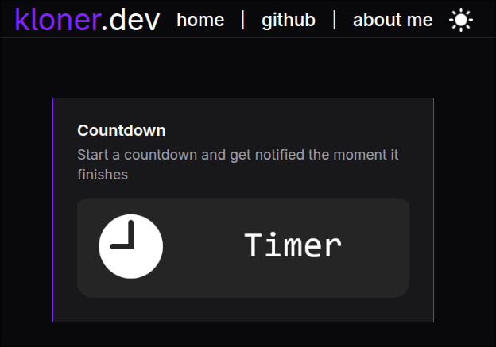
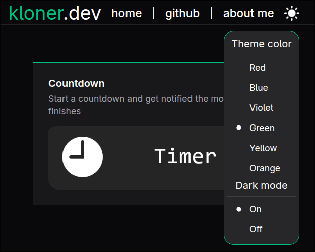

# kloner.dev

  
   
  
   
  <em>↑ Click to go to website ↑</em>
   
   
  
Welcome to my dev website repo, this is my little side of the internet where I just post/create what I want
 

## Content

- **Countdown Timer** - Start a countdown and get notified the moment it finishes
- **Theme switcher (Dark/Light/Color)** - Switch themes at the click of a button, themes get stored in local storage

... with more to come

### Created using

### Tools Used

## Screenshot

#### Theme Switcher

